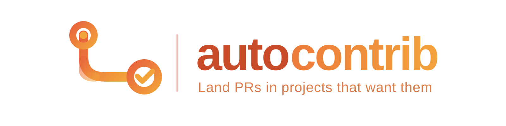

<p align="center">
  <strong>English</strong> · <a href="./README_ZH.md">简体中文</a>
</p>

<p align="center">
  
</p>

<p align="center">
  <a href="LICENSE"></a>
  <a href="autocontrib/SKILL.md"></a>
</p>

You want to contribute to open source — learn a codebase you admire, build a public track record, give something back. But most attempts don't fail at the code. They fail earlier: the issue was claimed hours before you found it; the repo's merge history is 100% maintainer commits; the bug you chased actually roots in a dependency, not the repo you filed against; or your patch is fine and simply never gets reviewed, because outsiders never do.

autocontrib is an Agent Skill built around that observation: **the hard part of contributing isn't writing the patch — it's finding a repository where your patch can land.** It walks the full arc from your interests to an open PR, and it was distilled from a real working session rather than an idealized flowchart.

```bash
npx skills add Momoyeyu/autocontrib -g
```

## What it actually does



Six stages, but you only ever make **two decisions**:

- **Pick what to work on.** The agent scouts GitHub Trending under your star ceiling, probes each repo's real openness — who actually gets merged, whether issues get maintainer replies, whether the fix even lives in that repo — and comes back with a ranked menu. You choose.
- **Approve what gets published.** The agent forks, claims, implements, tests, and writes the PR text — then stops. It hands you a patch list: what changed, what ran, what's missing. You approve, adjust, or drop each one.

Between those two gates it's autonomous. After the second, it pushes, opens the PR on the right base branch, and babysits CI until the maintainer takes over.


## The part most tools skip

The interesting stage isn't implementation — it's **assessment**. autocontrib checks things agents usually don't:

- **Do outsiders get merged?** It samples recent merged PRs by `authorAssociation`. A repo where every merge is `OWNER` is a closed club, no matter how good the issues look.
- **Does the fix live here?** Bugs surface in one repo but root in its dependencies — the agent follows imports before committing to a target.
- **Is the issue actually free?** Claimed issues are skipped, not raced. Fast-moving queues get noted, not gamed.
- **Will this scope survive review?** Security-model changes and architectural redesigns get proposed to maintainers as comments, never implemented blind.

And on the way out: the repo's own rules win. Base branch, sign-off, cryptographic signing, changelog, PR template, the documented test gate — read from `CONTRIBUTING.md`/`AGENTS.md` before anything is written.

## What you get back

| Moment | Artifact |
|---|---|
| After Scout | Ranked candidate table — stars, language, why it fits *your* profile, plus a flagged watch list just over the ceiling |
| After Assess | Issue menu per repo — acceptance evidence, effort estimate, honest confidence the agent can finish end-to-end |
| After Implement | Patch list — per change: branch, diff, tests actually run with results, known limitations |
| After Ship | PR table — URL, base/head, SHA, and CI status reported honestly: *no CI* and *waiting on maintainer approval* are not the same thing |
| Terminal | Status report — merged, closed-with-reason, or parked. An open PR is never reported as done |

Everything that faces a human — issue comments, commit messages, PR bodies — is written like a contributor wrote it: concise, technical, in the repository's primary language, no tool attribution.

## Does it land?

The scoreboard counts only merged PRs — an open one is never called done. Right now it holds one entry, and one is the point: the quality of where a patch lands matters more than the count.

### Tencent-Hunyuan/UniRL

<sub>MERGED · [#530](https://github.com/Tencent-Hunyuan/UniRL/pull/530), fixing [#514](https://github.com/Tencent-Hunyuan/UniRL/issues/514) · merged the day it opened</sub>

[UniRL](https://github.com/Tencent-Hunyuan/UniRL) is Tencent Hunyuan's unified framework for multimodal reinforcement learning.

**What we shipped.** Three uncalled helpers deleted from the sharded-state path (+1/−34). It wasn't cosmetic: they selected tensors by key substring, so once frozen "teacher" adapters could sit beside the trainable one, they would have silently leaked teacher weights into student exports. The live paths were already adapter-aware — the dead code was a quiet footgun.

**What autocontrib did.** Scouted UniRL as a repo where outside PRs actually get merged; assessed issue #514 before writing code — no in-repo callers, no competing PRs, the real paths go through `peft_merge`; built a throwaway verification harness (the repo's no-`tests/` policy meant nothing could be committed) and ran it on both Apple Silicon and CUDA; opened the PR against the project's own checklist, with the AI assistance disclosed. Merged the same day.

## Try it

Install the skill, then just ask:

```text
Find me promising AI-infra repos under 10k stars — issues I could realistically land.
```

```text
My interests: CUDA performance, LLM quantization, C++/Python tooling.
```

```text
Check how the four PRs are doing. Follow up any CI failures.
```

The first request builds an interest card and a ranked table, then asks which repos deserve a deeper look. Pushing anything always waits for your explicit go — that's a hard gate, not a suggestion.

## Helper scripts

Two small stdlib-only tools ship with the skill; the pipeline works fine without them:

```bash
python3 autocontrib/scripts/trending.py --weekly --max-stars 10000   # Trending under a star ceiling
python3 autocontrib/scripts/acceptance.py --repo OWNER/NAME          # external-PR acceptance probe
```

## Skill structure

| File | Load when |
|---|---|
| [`autocontrib/SKILL.md`](autocontrib/SKILL.md) | Entry: pipeline, gates, routing |
| [`references/scout.md`](autocontrib/references/scout.md) | Discovering and ranking candidates |
| [`references/assess.md`](autocontrib/references/assess.md) | Judging repo openness, picking issues |
| [`references/implement.md`](autocontrib/references/implement.md) | Forking, claiming, coding, committing |
| [`references/ship.md`](autocontrib/references/ship.md) | Pushing, PRs, tracking CI |
| [`scripts/trending.py`](autocontrib/scripts/trending.py) | Run, not read |
| [`scripts/acceptance.py`](autocontrib/scripts/acceptance.py) | Run, not read |

Progressive disclosure: read the current stage's reference only.

## Development

```bash
uv run --with pytest python -m pytest tests/ -v
```

Diagrams live in `docs/diagrams/` — Archify JSON sources finalized to standalone HTML and exported as auto-themed SVG, plus the hand-drawn brand lockup. Regenerate with `archify finalize <type> <json> <html> --quality showcase`, then Export → SVG from the HTML viewer.

## License

[MIT](LICENSE)
