<p align="center">
  <strong>English</strong> · <a href="./README_ZH.md">简体中文</a>
</p>

<p align="center">
  
</p>

<p align="center">
  <a href="LICENSE"></a>
  <a href="issuekiller/SKILL.md"></a>
</p>

GitHub is full of issues that want fixing — and most of them can't actually be closed by you. The issue was claimed hours before you found it; the repo's merge history is 100% maintainer commits; the bug you chased roots in a dependency, not the repo it was filed against; or your patch is fine and simply never gets reviewed, because outsiders never do.

issuekiller is an Agent Skill built around that observation: **the kill isn't the hard part — picking a target that can actually be killed is.** It walks the full arc from your interests to a merged PR, and it was distilled from a real working session rather than an idealized flowchart.

```bash
npx skills add Momoyeyu/issuekiller -g
```

## What it actually does



Six stages, but you only ever make **two decisions**:

- **Pick what to work on.** The agent scouts GitHub Trending under your star ceiling, probes each repo's real openness — who actually gets merged, whether issues get maintainer replies, whether the fix even lives in that repo — and comes back with a ranked menu. You choose.
- **Approve what gets published.** The agent forks, claims, implements, tests, and writes the PR text — then stops. It hands you a patch list: what changed, what ran, what's missing. You approve, adjust, or drop each one.

Between those two gates it's autonomous. After the second, it pushes, opens the PR on the right base branch, and babysits CI until the maintainer takes over.


## The part most tools skip

The interesting stage isn't implementation — it's **assessment**. issuekiller checks things agents usually don't:

- **Do outsiders get merged?** It samples recent merged PRs by `authorAssociation`. A repo where every merge is `OWNER` is a closed club, no matter how good the issues look.
- **Does the fix live here?** Bugs surface in one repo but root in its dependencies — the agent follows imports before committing to a target.
- **Is the issue actually free?** Claimed issues are skipped, not raced. Fast-moving queues get noted, not gamed.
- **Will this scope survive review?** Security-model changes and architectural redesigns get proposed to maintainers as comments, never implemented blind.

And on the way out: the repo's own rules win. Base branch, sign-off, cryptographic signing, changelog, PR template, the documented test gate — read from `CONTRIBUTING.md`/`AGENTS.md` before anything is written.

## What you get back

| Moment | Artifact |
|---|---|
| After Scout | Ranked candidate table — stars, language, why it fits *your* profile, plus a flagged watch list just over the ceiling |
| After Assess | Issue menu per repo — acceptance evidence, effort estimate, honest confidence the agent can finish end-to-end |
| After Implement | Patch list — per change: branch, diff, tests actually run with results, known limitations |
| After Ship | PR table — URL, base/head, SHA, and CI status reported honestly: *no CI* and *waiting on maintainer approval* are not the same thing |
| Terminal | Status report — merged, closed-with-reason, or parked. An open PR is never reported as done |

Everything that faces a human — issue comments, commit messages, PR bodies — is written like a contributor wrote it: concise, technical, in the repository's primary language, no tool attribution.

## Does it land?

Only merged PRs count here — an open one is never called done. Five entries so far. They're evidence, not score: each one means the match was right — a repo that reviews outsiders, an issue scoped to a real fix, a maintainer who wanted the patch kept.

### kvcache-ai/sglang

<sub>MERGED · [#100](https://github.com/kvcache-ai/sglang/pull/100), fixing [ktransformers#2214](https://github.com/kvcache-ai/ktransformers/issues/2214) · bug filed in one repo, fixed in its sibling</sub>

[SGLang](https://github.com/kvcache-ai/sglang) is a fast serving framework for LLMs and vision-language models — here, the kvcache-ai org's fork.

**What we shipped.** Under Transformers 5, GLM-4.5 MoE configs moved RoPE settings into `config.rope_parameters`, but `Glm4MoeDecoderLayer` still read the legacy top-level fields — every layer silently fell back to `rope_theta=10000`, quietly degrading long-context output. The patch resolves both fields through `get_rope_config` and adds a regression test that fails on the old code (+104/−5).

**What issuekiller did.** The bug was *filed* on `ktransformers`; assessment followed the imports into this sibling repo before a line was written. Then it verified on real hardware: an RTX 4090 D ran a tiny GLM4-MoE checkpoint end-to-end, confirming `rope_theta` resolves to `1_000_000` instead of `10_000`, with rotary outputs diverging past position 4096. Same fix as upstream `sgl-project/sglang#21135` — this fork had missed it.

### Tencent-Hunyuan/UniRL

[UniRL](https://github.com/Tencent-Hunyuan/UniRL) is Tencent Hunyuan's unified framework for multimodal reinforcement learning.

<sub>MERGED · [#530](https://github.com/Tencent-Hunyuan/UniRL/pull/530), fixing [#514](https://github.com/Tencent-Hunyuan/UniRL/issues/514) · merged the day it opened</sub>

**What we shipped.** Three uncalled helpers deleted from the sharded-state path (+1/−34). It wasn't cosmetic: they selected tensors by key substring, so once frozen "teacher" adapters could sit beside the trainable one, they would have silently leaked teacher weights into student exports. The live paths were already adapter-aware — the dead code was a quiet footgun.

**What issuekiller did.** Scouted UniRL as a repo where outside PRs actually get merged; assessed issue #514 before writing code — no in-repo callers, no competing PRs, the real paths go through `peft_merge`; built a throwaway verification harness (the repo's no-`tests/` policy meant nothing could be committed) and ran it on both Apple Silicon and CUDA; opened the PR against the project's own checklist, with the AI assistance disclosed. Merged the same day.

<sub>MERGED · [#536](https://github.com/Tencent-Hunyuan/UniRL/pull/536), fixing [#533](https://github.com/Tencent-Hunyuan/UniRL/issues/533) · the two sides of the ratio were scoring different quantities</sub>

**What we shipped.** `CPSSDEStrategy.compute_log_prob` returns only `-(x − μ)²`, but the SGLang adapter never set `rollout_log_prob_no_const` on the SDE path, so SGLang recorded the full Gaussian — a σ-dependent gap, not a constant. With `old_logp_source=rollout` almost every `cps` ratio clipped; with `replay` the drift metric was meaningless. `SDEStrategy` now declares `log_prob_no_const` (`True` for `cps`, `False` for `flow`/`dance`) and the adapter forwards it (+10/−0).

**What issuekiller did.** Took the "cleaner option" the issue itself suggested rather than the obvious one — emitting the full Gaussian on the train side would have changed `cps` loss scaling. Verified with a CPU-only harness that loads the three touched modules standalone (no `ray`, no `sglang`): the no-const path now matches `compute_log_prob` exactly, while the old path reproduces the issue's gap table. Second PR into this repo, merged inside a day.

### MakazhanAlpamys/Soup

[Soup](https://github.com/MakazhanAlpamys/Soup) fine-tunes LLMs from a single YAML — its layer streaming trains an 8B model on a 4 GB laptop GPU.

<sub>MERGED · [#1375](https://github.com/MakazhanAlpamys/Soup/pull/1375), fixing [#1355](https://github.com/MakazhanAlpamys/Soup/issues/1355) · 32 skipped cases brought back</sub>

**What we shipped.** The streamed test builders hardcoded `cuda or cpu`, so on Apple Silicon the model landed on CPU while the trainer picked `mps:0` — a device mismatch that had parked 32 test cases behind `skipif` marks. One `accelerator_device()` helper in `conftest`, returning exactly what the trainer picks, un-skipped the whole suite; all 32 pass (+97/−127).

**What issuekiller did.** Claimed the issue, consolidated three copies of the device probe into one helper, and verified both sides of the matrix on real hardware — the full suite on an M3 Ultra (29,080 tests, skip count down exactly 32) and the unchanged CUDA path on a 4090 D. Iterated through the maintainer's review to approved, then merged.

<sub>MERGED · [#1471](https://github.com/MakazhanAlpamys/Soup/pull/1471), fixing [#1349](https://github.com/MakazhanAlpamys/Soup/issues/1349) · scope narrowed to what review actually wanted</sub>

**What we shipped.** The `reasoning` data template asked for a "final answer" with no parseable form, so generated rows could ship golds the reward path can't read — which is how the GRPO demo fixture's unparsed rows happened. The prompt now names the markers the rewards parse: `####` for math rows, `Answer:` for logic/code. A new test pins the two fixture copies byte-identical and every gold parseable (+95/−2).

**What issuekiller did.** Re-scoped mid-flight: once #1371's variable-prefix rule landed, the planned fixture edit was redundant, so the PR shrank to the template fix plus the pin — per the plan confirmed on the issue. Iterated through a changes-requested review to approved; merged the next day.

## Try it

Install the skill, then just ask:

```text
Find me promising AI-infra repos under 10k stars — issues I could realistically land.
```

```text
My interests: CUDA performance, LLM quantization, C++/Python tooling.
```

```text
Check how the four PRs are doing. Follow up any CI failures.
```

The first request builds an interest card and a ranked table, then asks which repos deserve a deeper look. Pushing anything always waits for your explicit go — that's a hard gate, not a suggestion.

## Helper scripts

Two small stdlib-only tools ship with the skill; the pipeline works fine without them:

```bash
python3 issuekiller/scripts/trending.py --weekly --max-stars 10000   # Trending under a star ceiling
python3 issuekiller/scripts/acceptance.py --repo OWNER/NAME          # external-PR acceptance probe
```

## Skill structure

| File | Load when |
|---|---|
| [`issuekiller/SKILL.md`](issuekiller/SKILL.md) | Entry: pipeline, gates, routing |
| [`references/scout.md`](issuekiller/references/scout.md) | Discovering and ranking candidates |
| [`references/assess.md`](issuekiller/references/assess.md) | Judging repo openness, picking issues |
| [`references/implement.md`](issuekiller/references/implement.md) | Forking, claiming, coding, committing |
| [`references/ship.md`](issuekiller/references/ship.md) | Pushing, PRs, tracking CI |
| [`scripts/trending.py`](issuekiller/scripts/trending.py) | Run, not read |
| [`scripts/acceptance.py`](issuekiller/scripts/acceptance.py) | Run, not read |

Progressive disclosure: read the current stage's reference only.

## Development

```bash
uv run --with pytest python -m pytest tests/ -v
```

Diagrams live in `docs/diagrams/` — Archify JSON sources finalized to standalone HTML and exported as auto-themed SVG, plus the hand-drawn brand lockup. Regenerate with `archify finalize <type> <json> <html> --quality showcase`, then Export → SVG from the HTML viewer.

## License

[MIT](LICENSE)
