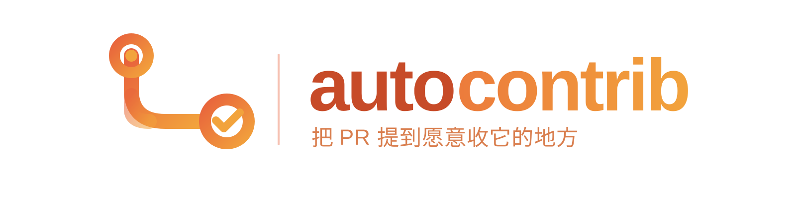

<p align="center">
  <a href="./README.md">English</a> · <strong>简体中文</strong>
</p>

<p align="center">
  
</p>

<p align="center">
  <a href="LICENSE"></a>
  <a href="autocontrib/SKILL.md"></a>
</p>

你想给开源做点贡献——读一个自己喜欢的项目的源码、攒一份公开可查的贡献记录、回馈一下一直在用的工具。但大多数失败的贡献，其实都不挂在写代码那一步，而是挂在更早的地方：看中的 issue 几小时前刚被人认领；仓库的 merge 记录翻到底全是 maintainer 自己；追了半天发现 bug 的根在依赖仓库里，PR 根本不该提到这；又或者补丁本身没问题，只是永远没人 review——因为外部人的 PR 从来没人 review 过。

autocontrib 是一个围绕这个观察做的 Agent Skill：**贡献开源真正的难点不是写补丁，而是找到一个你的补丁能被接纳的高价值仓库。** 它覆盖从兴趣画像到开出 PR 的完整链路，流程提炼自一次真实的工作流，而不是理想化的流程图。

```bash
npx skills add Momoyeyu/autocontrib -g
```

## 它具体做什么



六个阶段，但你只需要做**两个决定**：

- **决定做什么。** Agent 按你的星数上限扫 GitHub Trending，再逐个探测仓库的真实开放度——外部人的 PR 到底有没有被 merge 过、issue 有没有人回、病根在不在这个仓库——然后带回一份排序好的菜单。你来挑。
- **决定发什么。** Agent fork、认领、实现、写测试、拟 PR 文案——然后停下。它交给你一份补丁清单：改了什么、跑了什么、还缺什么。你逐个批准、打回、或者放弃。

两道闸门之间它是自主的；第二道闸门之后，它推送、按正确的 base 开 PR、盯着 CI 直到 maintainer 接手。


## 大多数工具跳过的那部分

真正值钱的阶段不是写代码，是**评估**。autocontrib 会查一些 agent 通常不查的事：

- **外人真的能被 merge 吗？** 抽样近期 merged PR 的 `authorAssociation` 分布。如果全是 `OWNER`，那这是个熟人俱乐部，issue 再好也别去。
- **病根在这个仓库吗？** bug 在这个仓库发作，根可能在它的依赖里——动手前先顺着 import 查清楚 PR 该提到哪。
- **issue 真的没人做吗？** 已被认领的直接跳过，不去抢。认领速度本身就记为信号。
- **这个改动 review 能过吗？** 涉及安全模型、架构边界的重写，写成方案评论交给 maintainer 定方向，绝不闷头改。

到了出口端也一样：仓库自己的规则最大。base 分支、sign-off、加密签名、changelog、PR 模板、文档规定的测试门禁——写代码之前先从 `CONTRIBUTING.md`/`AGENTS.md` 里读完。

## 你会拿到什么

| 时机 | 产物 |
|---|---|
| Scout 之后 | 候选排序表——星数、语言、为什么适合你的画像，外加刚好超上限的观察名单 |
| Assess 之后 | 各仓库 issue 菜单——接受度证据、工作量估计、agent 能否端到端做完的诚实把握 |
| Implement 之后 | 补丁清单——每个改动：分支、diff、实际跑过的测试和结果、已知限制 |
| Ship 之后 | PR 表——URL、base/head、SHA，以及诚实上报的 CI 状态：「没有 CI」和「等 maintainer 批准」是两回事 |
| 终态 | 状态报告——merged、closed-with-reason、或者搁置。open 的 PR 不会被报成完成 |

所有面向真人的东西——issue 评论、commit message、PR 正文——都按贡献者的写法来写：简洁、技术化、用仓库的主要语言、不带工具署名。

## 真的能落地吗

成绩单只数真正被合并的 PR——open 的永远不会被报成完成。现在只有一条，但一条就够了：落在哪，比落几个重要。

### Tencent-Hunyuan/UniRL

<sub>已合并 · [#530](https://github.com/Tencent-Hunyuan/UniRL/pull/530)，修复 [#514](https://github.com/Tencent-Hunyuan/UniRL/issues/514) · 提交当天被合并</sub>

[UniRL](https://github.com/Tencent-Hunyuan/UniRL) 是腾讯混元的统一多模态强化学习训练框架。

**做了什么。** 从 sharded-state 路径删掉三个无人调用的辅助函数（+1/−34）。这不是顺手清理：这些函数按 key 子串匹配 tensor——从 #432 开始可训练模块旁边能挂冻结的 teacher adapter，谁调用了它们，就会把 teacher 权重悄悄混进 student 的导出。真正在用的路径早已是 adapter-aware 的，这段死代码留着就是个隐患。

**autocontrib 做了什么。** Scout 阶段把 UniRL 识别为「外部 PR 真的会被合」的仓库；Assess 阶段在写代码之前把 #514 查到底——没有调用方、没有撞车的 PR、真实路径都走 `peft_merge`；仓库的 no-`tests/` 政策让测试无法提交，于是写了一次性验证 harness，在 Apple Silicon 和 CUDA 两台机器上跑通；最后按项目自己的 checklist 开 PR，并在正文里如实披露有 AI 参与。当天被合并。

## 试试看

装好 skill，直接说：

```text
帮我找 10k 星以下有潜力的 AI 基础设施仓库——要有我实际能落地的 issue。
```

```text
我的兴趣：CUDA 性能、LLM 量化、C++/Python 工具链。
```

```text
看看那四个 PR 的状态，有 CI 失败就快速跟进。
```

第一个请求会先建兴趣卡和候选排序表，然后问你想深入评估哪几个仓库。推送任何内容都要等你明确点头——这是硬闸门，不是建议。

## 辅助脚本

skill 自带两个零依赖小工具，不用它们流程也照样跑：

```bash
python3 autocontrib/scripts/trending.py --weekly --max-stars 10000   # Trending 按星数过滤
python3 autocontrib/scripts/acceptance.py --repo OWNER/NAME          # 外部 PR 接受度探测
```

## Skill 结构

| 文件 | 何时加载 |
|---|---|
| [`autocontrib/SKILL.md`](autocontrib/SKILL.md) | 入口：流水线、闸门、路由 |
| [`references/scout.md`](autocontrib/references/scout.md) | 发现和排序候选仓库 |
| [`references/assess.md`](autocontrib/references/assess.md) | 判断仓库开放度、挑选 issue |
| [`references/implement.md`](autocontrib/references/implement.md) | fork、认领、编码、提交 |
| [`references/ship.md`](autocontrib/references/ship.md) | 推送、开 PR、跟踪 CI |
| [`scripts/trending.py`](autocontrib/scripts/trending.py) | 运行而非阅读 |
| [`scripts/acceptance.py`](autocontrib/scripts/acceptance.py) | 运行而非阅读 |

渐进式披露：只读当前阶段的 reference。

## 开发

```bash
uv run --with pytest python -m pytest tests/ -v
```

图都在 `docs/diagrams/`——Archify JSON 源文件 finalize 成独立 HTML 后导出双主题 SVG，外加手绘的 brand lockup。重新生成：`archify finalize <type> <json> <html> --quality showcase`，然后在 HTML viewer 里 Export → SVG。

## License

[MIT](LICENSE)
